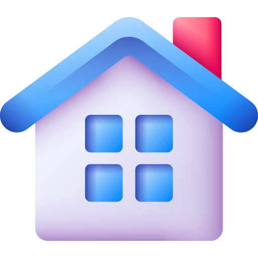

<div align="center">
  <h1> Kos Search - AI Powered Boarding House</h1>
</div>

<br/>

<p>Link Website: <a href="https://kos-search.vercel.app/" target="_blank">https://kos-search.vercel.app/</a></p>

<br/>

<br/>

## About Project

**Kos Search** is a modern full-stack boarding house directory platform that combines web technology with artificial intelligence. Relying on **Google Gemini 2.5 Flash**, this platform allows users to search for properties using everyday natural language, replacing rigid traditional UI filters. This platform is supported by a _Serverless_ architecture with a combination of React, Node.js, Prisma, and PostgreSQL.

This project was built to overcome **Search Fatigue** (interaction fatigue) where users have to waste a lot of time manually sorting through price, location, and facility checkboxes. With Kos Search, searching is as easy as chatting with a human assistant.

## Main Features

- **Zero-Click AI Search (NLP):** Smart boarding house search. Type a sentence like _"Find a male boarding house in Semarang, must have AC and a private bathroom, maximum 1.5 million"_, and the AI will extract it automatically.
- **Dynamic Relational Mapping:** Translates JSON parameters from the AI directly into advanced PostgreSQL database queries via Prisma ORM.
- **Multi-Role Ecosystem:** Separate portals for **Kos Seekers** (Public) and **Kos Owners** (Owner) to manage properties independently.
- **Secure Cloud Storage:** Boarding house image storage integration directly to Supabase Storage Bucket with server role authentication management (_Server Role_).

## Tech Stack

This application was developed using a modern Client-Server architecture (Microservices-lite):

**Frontend:**

- **React.js (v19) & Vite**
- **Tailwind CSS (v4)**
- **Zustand** (State Management)
- **React Router DOM (v7)**

**Backend & Database:**

- **Node.js & Express.js (v5)** (TypeScript)
- **Prisma ORM (v6)**
- **Supabase (PostgreSQL) & Supabase Storage**

**Artificial Intelligence:**

- **Google Generative AI SDK** (Model: Gemini 2.5 Flash)

**Deployment:**

- **Vercel Serverless Functions**

## System Architecture

```mermaid
flowchart TD
    %% Custom Colors based on roles
    classDef userLayer fill:#dbeafe,stroke:#3b82f6,stroke-width:2px,color:#1e3a8a,font-family:sans-serif;
    classDef aiLayer fill:#fef08a,stroke:#eab308,stroke-width:2px,color:#854d0e,font-family:sans-serif;
    classDef backendLayer fill:#dcfce7,stroke:#22c55e,stroke-width:2px,color:#14532d,font-family:sans-serif;
    classDef dbLayer fill:#f3e8ff,stroke:#a855f7,stroke-width:2px,color:#581c87,font-family:sans-serif;
| Phase | Flow / Action | Technology Used | Description |
| :--- | :--- | :--- | :--- |
| **1. User Interaction** | `User Input` ➔ `Frontend` ➔ `Backend` | React, Express.js | The user types a natural language prompt. The React frontend captures this and forwards the payload to the Node.js backend. |
| **2. AI Extraction** | `Backend` ➔ `Gemini AI` ➔ `JSON` | Gemini 2.5 Flash API | The backend injects a strict schema. The AI processes the prompt and extracts criteria (City, Price, Facilities) into structured JSON. |
| **3. Data Processing** | `JSON` ➔ `Prisma ORM` ➔ `Database` | Prisma, PostgreSQL | The backend parses the JSON and Prisma ORM dynamically builds and executes the relational filters on the Supabase database. |
| **4. Search Results** | `Database` ➔ `Backend` ➔ `Frontend` | React, Supabase | The database returns the matching records. The backend sends the Kost array back to the frontend, which renders the Kost Card catalog. |

    style S1 fill:#ffffff,stroke:#94a3b8,stroke-width:1px,stroke-dasharray: 5 5,color:#64748b,font-weight:bold
    style S2 fill:#ffffff,stroke:#94a3b8,stroke-width:1px,stroke-dasharray: 5 5,color:#64748b,font-weight:bold
    style S3 fill:#ffffff,stroke:#94a3b8,stroke-width:1px,stroke-dasharray: 5 5,color:#64748b,font-weight:bold
    style S4 fill:#ffffff,stroke:#94a3b8,stroke-width:1px,stroke-dasharray: 5 5,color:#64748b,font-weight:bold

    subgraph S1 [1. User Interaction]
        direction LR
        U1(User Input<br>Natural Language Prompt):::userLayer --> F1(Frontend React<br>Forward Payload):::userLayer --> B1(Backend Node.js<br>Receive Request):::backendLayer
    end

    subgraph S2 [2. AI Feature Extraction]
        direction RL
        B2(Inject Prompt Schema<br>Structured Output):::backendLayer --> A1(Google Gemini 2.5 Flash<br>NLP Model):::aiLayer --> A2(JSON Response<br>City, Price, Facilities):::aiLayer
    end

    subgraph S3 [3. Relational Data Processing]
        direction LR
        B3(Backend Controller<br>Parsing JSON):::backendLayer --> P1(Prisma ORM<br>Dynamic Query Builder):::backendLayer --> D1(Supabase DB<br>Execute PostgreSQL Filter):::dbLayer
    end

    subgraph S4 [4. Return Search Results]
        direction RL
        B4(Backend API<br>Send Kost Object Array):::backendLayer --> F2(Frontend React<br>Render Component):::userLayer --> U2(User Screen<br>Kost Card Catalog):::userLayer
    end

    S1 --> S2
    S2 --> S3
    S3 --> S4
```

<br/>

<div align="center">
  <b>Built by Widi Puriarto</b> with ❤️ for better living.
</div>
